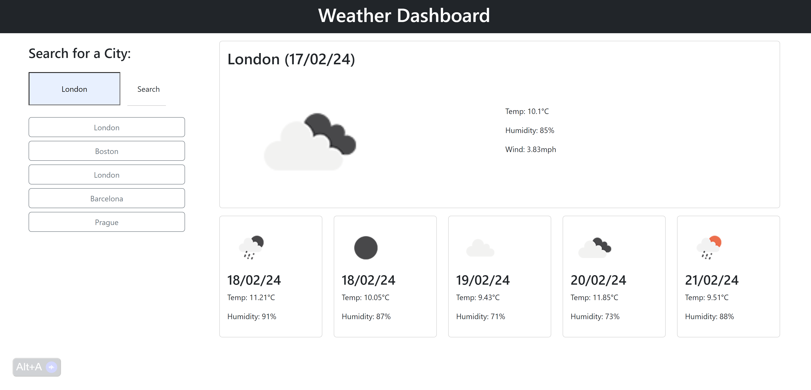

# Weather Dashboard

## Description

A weather dashboard application that allows the user to search for the weather forecast for their chosen city. The app will show the forecast for next 5 days.

## User Story

```md
AS A traveler
I WANT to see the weather outlook for multiple cities
SO THAT I can plan a trip accordingly
```

## Installation

You can install the project on your local machine by cloning or downloading the repository.

## Usage

Visit the Weather Dashboard application [here](https://georgiehackett.github.io/weather-dashboard/).

To use the weather dashboard search for a city. Once your input is submitted, data for your chosen location will be displayed.

Data displayed includes:
    * The city name
    * The date
    * An icon representation of weather conditions
    * The temperature
    * The humidity
    * The wind speed

Your five most recent searches will be stored and displayed as buttons for you to search again.

The app's functionality should resemble the following:

 

## Technologies


## APIs Used

* https://openweathermap.org/forecast5
